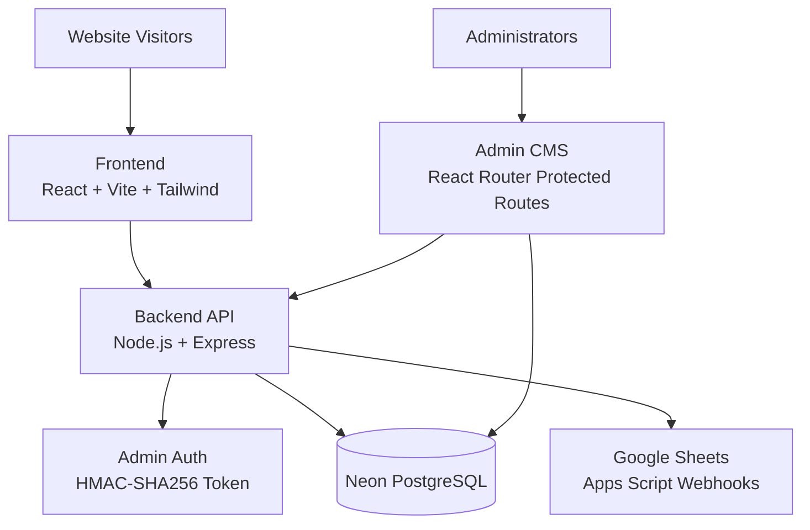
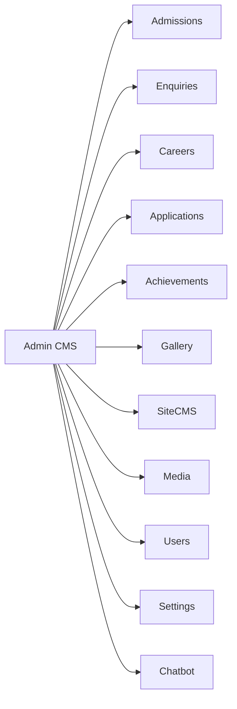
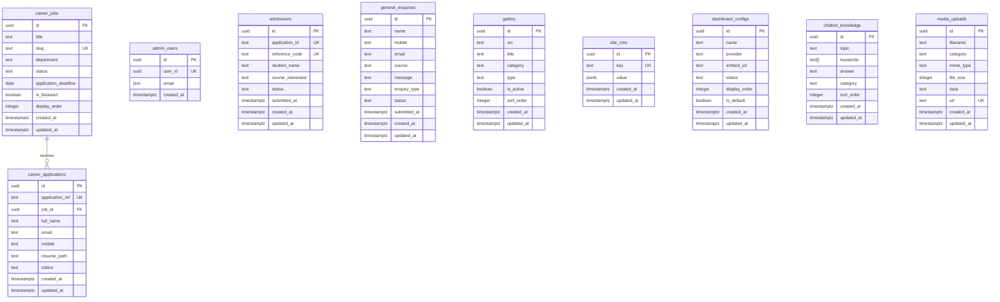

# Prarthana PU Science College — School Management CMS

## 1. Project Overview

Prarthana PU Science College, Bagalkot operates a full-stack school management CMS that combines a public-facing college website with an administrative content management system. The platform handles online admissions, general enquiries, career job postings, gallery management, site-wide content editing, and admin user management — all backed by a PostgreSQL database.

The project serves three audiences:
- **Website visitors** — prospective students and parents exploring courses, admissions, achievements, and campus life.
- **College administrators** — managing enquiries, admissions, careers, gallery, website content, and media through a protected admin portal.
- **Developers / evaluators** — reviewing a production-grade React + Node.js application with a documented architecture.

---

## 2. Key Features

### Public Website
- Responsive multi-page website with Home, About, Courses, Achievements, Gallery, Fee Structure, Transport, Careers, Admission, and Contact pages.
- Dynamic hero carousel, achievement counters, testimonial sections, and campus facility highlights.
- Admission enquiry popup triggered by scroll.
- Integrated WhatsApp and phone-click contact actions.
- Embedded Google Maps location display.

### Admin CMS
- **Dashboard** — real-time metrics for admissions, enquiries, active career jobs, applications, and CMS sync status.
- **Admissions** — full online admission application form with validation, status tracking, and reference code generation.
- **Enquiries** — general enquiry management (contact form + popup) with status updates.
- **Careers** — job posting management (create, edit, deactivate) and career application review with resume access.
- **Gallery** — image and video gallery management with categories, ordering, and active/inactive toggles.
- **Site CMS** — centralized content editing for branding, contact info, hero slides, about page, leadership, courses, fees, scholarships, transport, hostel, pamphlet, navbar, footer, and chatbot knowledge base.
- **Media Library** — upload, replace, and delete media assets used across the website.
- **Admin Users** — manage authorized admin accounts.
- **Settings** — CMS synchronization, default content seeding, and security policy overview.

### Additional Capabilities
- **Authentication** — token-based admin login with server-side authorization checks.
- **PDF Generation** — admission application PDF with QR code (jsPDF + qrcode).
- **Google Sheets Sync** — background sync of admissions and enquiries to Google Sheets via Google Apps Script.
- **Chatbot** — AI-style chatbot with a dynamic knowledge base managed through the CMS.
- **Search / Filtering** — admin-side filtering and listing of admissions, enquiries, and career applications.

---

## 3. Technology Stack

| Layer | Technology | Purpose |
| ----- | ---------- | ------- |
| Frontend Framework | React 18 + TypeScript | Component-based UI with static typing |
| Build Tool | Vite 5 | Development server and production bundling |
| Routing | React Router DOM 6 | Client-side route management |
| Styling | Tailwind CSS 3 | Utility-first responsive design |
| Animations | Framer Motion 11 | Scroll-triggered and interaction animations |
| Icons | Lucide React | Consistent icon set |
| Backend Runtime | Node.js + Express 5 | REST API server |
| Database Driver | pg (node-postgres) 8 | PostgreSQL connection pooling |
| Database | Neon PostgreSQL | Primary data store |
| PDF Generation | jsPDF + qrcode | Admission receipt generation |
| Utilities | clsx, tailwind-merge | Conditional className composition |

---

## 4. System Architecture



**Components**
- **Frontend** — Static React SPA served to visitors and admins.
- **Backend API** — Express server handling CRUD operations, authentication, file uploads, and health checks.
- **Database** — Neon PostgreSQL storing admissions, enquiries, careers, gallery, CMS content, and media metadata.
- **Authentication** — Server-issued HMAC-signed tokens stored in `localStorage`.
- **External Services** — Google Apps Script for spreadsheet sync; Google Maps for location display.

---

## 5. System Flow

### Public Website Flow

```text
Visitor
   ↓
Frontend (React SPA)
   ↓
Backend API (Express)
   ↓
Database (Neon PostgreSQL)
   ↓
Response (JSON)
   ↓
Frontend renders content
```

### Admin CMS Flow

```text
Admin
   ↓
Admin Login (/api/auth/login)
   ↓
Token stored in localStorage
   ↓
Admin Dashboard / CMS pages
   ↓
Backend API (authenticated requests)
   ↓
Database (Neon PostgreSQL)
   ↓
Updated website content reflected on public site
```

---

## 6. Module Architecture



---

## 7. Database Architecture

The project uses **Neon PostgreSQL** as its primary database.

### ER Diagram



---

## 8. API Architecture

### Purpose
The Express backend provides a REST API for the React frontend and external integrations. All database access is server-side through parameterized queries.

### Main Endpoint Groups

| Group | Methods | Purpose |
|-------|---------|---------|
| `/api/health` | GET | Database connectivity check |
| `/api/auth` | POST, GET | Admin login and session validation |
| `/api/admissions` | GET, POST, PATCH, DELETE | Admission application management |
| `/api/general-enquiries` / `/api/enquiries` | GET, POST, PATCH, DELETE | Enquiry management |
| `/api/career-jobs` | GET, POST, PATCH, DELETE | Career job posting management |
| `/api/career-applications` | GET, POST, PATCH, DELETE | Job application management |
| `/api/gallery` | GET, POST, PATCH, DELETE | Gallery item management |
| `/api/site-cms` | GET, PUT | Site-wide content key/value store |
| `/api/media` | GET, POST, PUT, DELETE | Media asset management |
| `/api/uploads` | POST | Generic file upload handling |
| `/api/dashboard-configs` | GET, POST, PATCH, DELETE | Dashboard embed configuration |
| `/api/admin-users` | GET | Admin user listing |
| `/api/chatbot-knowledge` | GET, POST | Chatbot knowledge base |

### Authentication
- Admin routes use a `requireAdmin` middleware that validates HMAC-SHA256 signed Bearer tokens.
- Tokens are issued on login and stored client-side in `localStorage`.
- Public routes (form submissions, gallery view, chatbot) do not require authentication.

### CRUD Operations
All mutations use server-side sanitization and parameterized SQL queries via `pg`. Read queries support optional admin mode for accessing inactive/hidden records.

### Database Interaction
- Connection pooling via `pg.Pool`.
- Query timeouts and retry logic for transient connection errors.
- Health check endpoint verifies database connectivity.

---

## 9. Authentication & Security

### Admin Authentication
- Login endpoint: `POST /api/auth/login`
- Credentials: email + password validated against `admin_users` table and `ADMIN_PASSWORD` environment variable.
- Session token: HMAC-SHA256 signed JWT-like token with 12-hour expiry, stored in `localStorage`.

### Authorization
- `requireAdmin` middleware protects all admin API routes.
- Admin membership verified via `admin_users` table lookup.
- Database RLS policies enforce row-level security (Supabase/PostgreSQL).

### Password Handling
- Single admin password configured via `ADMIN_PASSWORD` environment variable.
- No password hashing or per-user passwords in the current implementation.

### Environment Variables
- `DATABASE_URL` — PostgreSQL connection string.
- `ADMIN_PASSWORD` — Admin login password.
- `ADMIN_SESSION_SECRET` — HMAC signing secret for session tokens.
- `PORT` — Server port (default 3000).
- `FRONTEND_URL` / `PRODUCTION_FRONTEND_URL` — CORS allowed origins.
- `VITE_API_BASE_URL` / `VITE_API_URL` — Frontend API base URL.

### API Protection
- CORS enforced with configured origin whitelist.
- Admin routes reject requests without valid Bearer tokens.
- File upload size limited to 50MB JSON payloads.

### Database Security
- Parameterized queries prevent SQL injection.
- RLS policies restrict anonymous access to public INSERT only where intended.
- Connection SSL enforced (`rejectUnauthorized: false` for Neon compatibility).

### Input Validation
- Admission and enquiry payloads sanitized server-side (null coalescing, type casting, date sanitization).
- Frontend form validation for required fields, mobile number format, and email format.

### Error Handling
- Centralized `ok()` / `fail()` response helpers.
- Global Express error handler catches JSON parse errors and unhandled exceptions.
- Unhandled promise rejections and uncaught exceptions logged to console.

---

## 10. Deployment Architecture

### CURRENT DEPLOYMENT

| Component | Hosting | URL / Identifier |
|-----------|---------|------------------|
| Frontend | Cloudflare Workers / Pages | `prarthanaclgbgk.prarthanapusciencecollege-web.workers.dev` |
| Backend API | Render | `prarthanaclgbgk.onrender.com` |
| Database | Neon PostgreSQL | Neon serverless Postgres |
| Container | Docker (optional) | Multi-stage Node 20 Alpine build |

### Deployment Details
- **Frontend** — Built with `npm run build` (Vite) and deployed as static assets. Cloudflare Workers origin is whitelisted in backend CORS.
- **Backend** — Node.js Express server. Serves static `dist/` files in production and handles all API routes.
- **Database** — Neon PostgreSQL with SSL. Connection pooling and query timeouts configured.
- **Docker** — Multi-stage Dockerfile available for containerized deployment (builder + runner stages).

### FUTURE MIGRATION
Oracle Cloud migration is a future deployment consideration and is not part of the current production architecture.

---

## 11. Data Flow

### Admissions
```text
Student fills admission form
   ↓
Frontend validates input
   ↓
POST /api/admissions
   ↓
Backend sanitizes payload, generates application_id + reference_code
   ↓
INSERT INTO admissions (Neon PostgreSQL)
   ↓
Background: POST to Google Apps Script (Google Sheets)
   ↓
Admin views admission in dashboard
   ↓
Admin updates status (PATCH /api/admissions)
```

### Enquiries
```text
Visitor submits contact form or popup
   ↓
POST /api/general-enquiries
   ↓
INSERT INTO general_enquiries (Neon PostgreSQL)
   ↓
Background: POST to Google Apps Script (Google Sheets)
   ↓
Admin views enquiry in dashboard
```

### Career Jobs & Applications
```text
Admin creates job posting via CMS
   ↓
POST /api/career-jobs
   ↓
INSERT INTO career_jobs
   ↓
Public visitor views active jobs
   ↓
GET /api/career-jobs (status = 'active')
   ↓
Visitor submits application + resume
   ↓
POST /api/career-applications
   ↓
INSERT INTO career_applications
   ↓
Admin reviews application, updates status
```

### Achievements, Courses, Gallery, Site CMS
```text
Admin edits content via CMS
   ↓
PUT /api/site-cms/:key
   ↓
UPSERT INTO site_cms (JSONB value)
   ↓
Frontend fetches merged CMS + defaults
   ↓
Public website renders updated content
```

---

## 12. Project Structure

```text
pratharna-clg-bgk/
├── .env
├── .env.example
├── .env.production
├── .eslintrc.json
├── Dockerfile
├── netlify.toml
├── package.json
├── postcss.config.js
├── tailwind.config.ts
├── tsconfig.json
├── vite.config.ts
├── index.html
├── public/
│   └── sitemap.xml
├── server/
│   └── index.js
├── src/
│   ├── App.tsx
│   ├── main.tsx
│   ├── index.css
│   ├── vite-env.d.ts
│   ├── components/
│   │   ├── admin/
│   │   ├── carousels/
│   │   ├── chatbot/
│   │   ├── communication/
│   │   ├── gallery/
│   │   ├── motion/
│   │   ├── popup/
│   │   ├── sections/
│   │   └── shared/
│   ├── data/
│   ├── hooks/
│   ├── lib/
│   │   ├── api.ts
│   │   ├── careers.ts
│   │   ├── cms.ts
│   │   ├── cms-context.tsx
│   │   ├── cms-defaults.ts
│   │   ├── cms-upload.ts
│   │   ├── communication.ts
│   │   ├── enquiries.ts
│   │   ├── google-script-config.ts
│   │   ├── motion.ts
│   │   ├── neon-api.ts
│   │   ├── pdf-generator.ts
│   │   ├── site-config.ts
│   │   ├── submissions.ts
│   │   └── utils.ts
│   └── pages/
│       ├── admin/
│       ├── about-page.tsx
│       ├── achievements-page.tsx
│       ├── admission-page.tsx
│       ├── admission-success-page.tsx
│       ├── career-job-page.tsx
│       ├── careers-page.tsx
│       ├── contact-page.tsx
│       ├── courses-page.tsx
│       ├── fee-structure-page.tsx
│       ├── gallery-page.tsx
│       ├── home-page.tsx
│       ├── not-found-page.tsx
│       ├── offline-page.tsx
│       └── transport-page.tsx
├── supabase/
│   └── migrations/
│       ├── 20260714084259_create_admissions_system.sql
│       ├── 20260722163258_create_admission_and_enquiry_tables.sql
│       ├── 20260725191503_extend_admission_enquiries_with_new_fields.sql
│       ├── 20260725192642_extend_admission_enquiries_reception_fields.sql
│       ├── 20260725195348_add_admission_pdf_storage.sql
│       ├── 20260725200310_upgrade_admission_management_system.sql
│       ├── 20260809_create_admin_users.sql
│       ├── 20260809_create_site_cms_and_dashboard_configs.sql
│       ├── 20260809_full_cms_storage_admin.sql
│       ├── 20260809_unify_admin_cms_admissions_enquiries.sql
│       ├── 20260810000000_create_public_admissions_for_current_form.sql
│       ├── 20260810010000_ensure_public_admissions_current_form.sql
│       ├── 20260810120000_fix_dashboard_configs_and_general_enquiries.sql
│       ├── 20260810140000_cms_assets_pdf_and_dashboard_updated_at.sql
│       ├── 20260810160000_ensure_cms_storage_and_site_cms.sql
│       ├── 20260810160000_ensure_cms_storage_buckets.sql
│       ├── 20260810170000_ensure_general_enquiries_pipeline.sql
│       ├── 20260811090000_create_careers_system.sql
│       ├── 20260811120000_fix_admissions_updated_at.sql
│       ├── 20260811143000_fix_admin_authorization.sql
│       └── 20260813_create_gallery_table.sql
├── dist/
└── node_modules/
```

---

## 13. Local Development

### Prerequisites
- Node.js 18+ and npm
- Neon PostgreSQL database (or compatible PostgreSQL instance)

### Commands

```bash
# Install dependencies
npm install

# Start development server (frontend + backend proxy)
npm run dev

# Run backend only
npm run start

# Build for production
npm run build

# Preview production build
npm run preview
```

### Environment Setup
Copy `.env.example` to `.env` and configure:
- `DATABASE_URL` — PostgreSQL connection string
- `ADMIN_PASSWORD` — admin login password
- `ADMIN_SESSION_SECRET` — session signing key
- `PORT` — backend port (default 3000)

---

## 14. Environment Variables

| Variable | Purpose |
|----------|---------|
| `DATABASE_URL` | PostgreSQL connection string (Neon) |
| `ADMIN_PASSWORD` | Admin panel login password |
| `ADMIN_SESSION_SECRET` | HMAC secret for signing admin session tokens |
| `PORT` | Backend server port (default: 3000) |
| `FRONTEND_URL` | Allowed CORS origin for local development |
| `PRODUCTION_FRONTEND_URL` | Allowed CORS origin for production frontend |
| `VITE_API_BASE_URL` | Frontend API base URL (Vite-exposed) |
| `VITE_API_URL` | Alternative frontend API base URL (Vite-exposed) |
| `DB_CONNECTION_TIMEOUT_MS` | Database connection timeout (default: 5000) |
| `DB_QUERY_TIMEOUT_MS` | Database query timeout (default: 12000) |

---

## 15. Admin CMS Workflow

### Admissions
1. Admin logs into `/admin/login`.
2. Navigate to **Admissions** to view all submitted applications.
3. Review student details, course interest, and uploaded documents.
4. Update status (Submitted, Under Review, Approved, Rejected, etc.).
5. Use reference code or application ID to track specific applicants.

### Enquiries
1. Admin views all general enquiries (contact form + popup) in **Enquiries**.
2. Filter by status, course, or source.
3. Update enquiry status and add internal notes.
4. Delete resolved enquiries if needed.

### Careers
1. Admin creates job postings in **Careers** with title, department, description, deadline, and status.
2. Visitors browse active jobs on the public Careers page.
3. Admin reviews submitted applications (with resumes) in **Career Applications**.
4. Update application status through the hiring pipeline.

### Gallery
1. Admin uploads images or videos via **Gallery** in the CMS.
2. Assign categories (Campus, Laboratories, Classrooms, Library, Events, Videos).
3. Reorder items and toggle active/inactive status.
4. Public gallery page renders ordered, active items.

### Website Content (Site CMS)
1. Admin edits site-wide content in **CMS > Site Config**.
2. Sections include branding, contact, hero slides, about, leadership, courses, fees, achievements, gallery, transport, hostel, pamphlet, navbar, footer, and chatbot.
3. Changes are saved to `site_cms` table and immediately reflected on the public website.

### Media
1. Admin uploads media files via **Media Library** or inline CMS uploaders.
2. Files are stored as base64 in `media_uploads` table with a local disk fallback.
3. Public routes serve media via `/uploads/:category/:filename`.

### Admin Users
1. Superuser provisions admin accounts in the `admin_users` table.
2. Only authenticated users with matching `user_id` can access the admin panel.

---

## 16. Testing

No automated test suite is currently configured in the project.

### Manual Verification
- Run `npm run build` to verify TypeScript compilation and Vite bundling succeed.
- Run `npm run dev` and manually verify public pages and admin flows.
- Backend health check available at `GET /api/health`.

---

## 17. Future Enhancements

Planned or considered features not yet implemented:
- Oracle Cloud migration for backend hosting.
- Per-user admin accounts with role-based access control and password hashing.
- Automated test suite (unit, integration, E2E).
- Advanced analytics and reporting dashboards.
- Email notification service for admissions and enquiries.
- Multi-language (i18n) support.

> **Note:** Oracle Cloud migration is a future deployment consideration and is not part of the current production architecture.

---

## 18. Project Status

| Aspect | Status |
|--------|--------|
| Frontend Hosting | Cloudflare Workers / Pages |
| Backend Hosting | Render |
| Database | Neon PostgreSQL |
| Domain | `prarthanapusciencecollege.in` |
| Major Modules | Public Website, Admin CMS, Admissions, Enquiries, Careers, Gallery, Site CMS, Media Library, Chatbot, PDF Generation, Google Sheets Sync |
